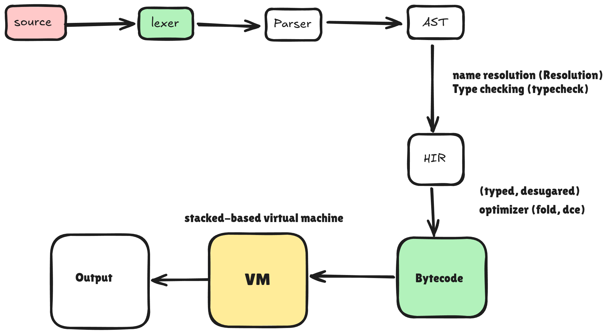

# Lumen

A small, statically-typed programming language and its compiler, written in
idiomatic Rust. Lumen takes a program through a full, explicit compiler pipeline
(lexing, parsing, name resolution, type checking, a typed intermediate
representation, optimization, and code generation) and runs the result on a
stack-based bytecode virtual machine.

It is built as a study in professional compiler engineering: correct,
observable, thoroughly tested, and small enough to read end to end.

```lumen
fn fib(n: i64) -> i64 {
    if n < 2 { n } else { fib(n - 1) + fib(n - 2) }
}

fn main() {
    for i in 0..11 {
        print_int(fib(i));
    }
}
```

```console
$ lumenc run examples/fib.lm
0
1
1
2
3
5
8
13
21
34
55
```

## Architecture

The compiler is an explicit sequence of phases, each with a narrow public API,
its own diagnostics, and its own data type. No phase mutates another's output.



| Phase            | Module             | Output                          |
|------------------|--------------------|---------------------------------|
| Lexer            | `lexer`            | `Vec<Token>`                    |
| Parser           | `parser`           | `Ast` (Pratt-based)             |
| Name resolution  | `sema::resolve`    | `Resolution` side tables        |
| Type checking    | `sema::typeck`     | `Typeck` side tables            |
| Lowering         | `hir`              | typed, desugared `Hir`          |
| Optimizer        | `opt`              | inlined, folded `Hir`           |
| Code generation  | `backend::codegen` | `Program` bytecode              |
| VM               | `backend::vm`      | program output / value          |

Beyond the core path, the same typed HIR feeds two more backends used for
analysis and validation: a CFG-based mid-level IR (`mir`) with its own data-flow
optimizer and interpreter, and a C transpiler (`backend::c`) for the scalar
subset. A bytecode verifier (`backend::verify`) checks any program (including one
loaded from an object file) before it runs.

The full design rationale is in [`docs/DESIGN.md`](docs/DESIGN.md); the language
reference is in [`docs/LANGUAGE.md`](docs/LANGUAGE.md).

## Features

- **First-class diagnostics**: error codes (`E0001`..`E0318`), multi-span
  labels, notes and help, rendered with `miette`. Every phase is
  error-tolerant and reports as many problems as it can in one run. `lumenc
  explain <CODE>` prints a worked explanation of any code.
- **A real type system**: `i64`, `f64`, `bool`, `str`, `unit`, arrays, structs,
  and tuples; inference for `let`; no implicit conversions; divergence analysis
  for returns.
- **Expression-oriented control flow**: `if`/`else`, `while`, counted `for`,
  `for`-each over arrays, `match` on scalar patterns, and `break`/`continue`.
- **An optimizer**: function inlining, constant folding, algebraic
  simplification, and dead-code elimination over HIR, run to a fixpoint, each
  transformation guarded for soundness.
- **A mid-level IR**: a CFG of basic blocks with classic data-flow passes
  (constant folding, copy propagation, common-subexpression elimination,
  dead-store and dead-code elimination, CFG simplification) and an interpreter
  that is validated to agree with the stack VM.
- **A bytecode VM**: stack-based, with call frames, recursion, and runtime error
  handling; never panics on bad input. A verifier proves stack balance, in-range
  operands, and call arity before execution.
- **Ahead-of-time artifacts**: `lumenc build` writes a textual bytecode object
  file that `lumenc exec` verifies and runs without recompiling from source.
- **A standard library of builtins**: integer and float math, numeric
  conversions, and string operations (see the language reference).
- **Structured observability**: `#[tracing::instrument]` on every phase, plus
  `lumenc --time` for per-phase timings.
- **Tested throughout**: unit, property (`proptest`), integration, and
  regression tests, plus `criterion` benchmarks.

## Using the compiler

First build the compiler:

```console
$ cargo build --release
```

This produces the `lumenc` binary at `target/release/lumenc`. The commands below
write it simply as `lumenc`, which only works if that binary is on your `PATH`.
Pick one of these:

- **Run it by path** (no setup): replace `lumenc` with `./target/release/lumenc`,
  e.g. `./target/release/lumenc run examples/primes.lm`.
- **Run it via cargo** (no separate build step): put the arguments after `--`,
  e.g. `cargo run --release -- run examples/primes.lm`.
- **Install it** so plain `lumenc` works: `cargo install --path .` puts `lumenc`
  in `~/.cargo/bin/` (on the default Rust `PATH`). Then the commands below work
  verbatim. Check it with `which lumenc`.

```console
$ lumenc run    examples/primes.lm     # compile and execute
$ lumenc check  examples/primes.lm     # type-check only
$ lumenc fmt    examples/primes.lm     # print canonically-formatted source
$ lumenc build  examples/fib.lm -o fib.lbc   # compile to a bytecode object
$ lumenc exec   fib.lbc                # verify and run a built object
$ lumenc explain E0318                 # explain a diagnostic code

$ lumenc dump   ast      examples/fib.lm
$ lumenc dump   hir-opt  examples/fib.lm
$ lumenc dump   mir      examples/fib.lm
$ lumenc dump   bytecode examples/fib.lm
$ lumenc run    examples/fib.lm --time # per-phase timings on stderr

$ RUST_LOG=lumen=debug lumenc run examples/fib.lm   # structured logs
```

Dump forms: `tokens`, `ast`, `hir`, `hir-opt`, `mir`, `cfg`, `c`, `bytecode`,
`verify`. Optimization is on by default; pass `-O0` to disable it.

## Examples

The [`examples/`](examples) directory holds runnable programs (`fib`,
`factorial`, `fizzbuzz`, and `primes`), each verified by the test suite.

## Development

```console
$ cargo test                                   # unit + integration + regression
$ cargo bench                                  # criterion benchmarks
$ cargo clippy --all-targets --all-features -- -D warnings
$ cargo fmt --check
```

The project pins a Rust toolchain via `rust-toolchain.toml` (Rust 1.96, edition
2024) so builds are reproducible.

## Project layout

```
src/
  span.rs, source.rs        spans and the line-indexed source map
  errors.rs, diagnostics.rs error codes and the diagnostics subsystem
  explain.rs, suggest.rs    error explanations and "did you mean" hints
  lexer/                    tokens and the scanner
  parser/                   AST, the parser, and an AST printer
  sema/                     types, name resolution, type checking
  hir/                      typed IR, lowering, and an HIR printer
  opt/                      the pass manager: inlining, folding, DCE
  mir/                      CFG-based mid-level IR, passes, interpreter
  backend/                  bytecode, codegen, VM, disassembler, verifier,
                            peephole optimizer, object format, C transpiler
  format.rs                 the source formatter
  session.rs                the pipeline driver
  main.rs                   the `lumenc` CLI
docs/                       design and language documentation
examples/                   sample programs
benches/                    criterion benchmarks
tests/                      integration, regression, and example tests
```

## License

MIT. See [`LICENSE`](LICENSE).
